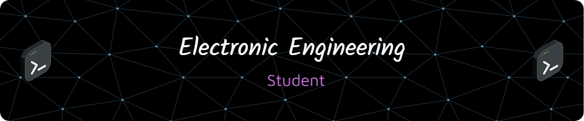

<h1 align="center">Hi 👋, I'm Shihab Ud Doula</h1>
<h3 align="center">AI Enthusiast | Autonomous Vehicle Systems | IoT and Cybersecurity Developer</h3>

  

- 🔭 I’m currently working on **Bachelor Thesis: Spoofing Attack Prevention System for Autonomous Vehicles using AI**

- 🌱 I’m currently learning **Deep learning frameworks (TensorFlow, PyTorch), Machine Learning for cybersecurity, and C++ for embedded systems**

- 👯 I’m looking to collaborate on **AI-based Autonomous Systems and IoT Solutions**

- 🤝 I’m looking for help with **Advanced Deep Learning Models for Cybersecurity in Automotive Systems**

- 💬 Ask me about **Autonomous vehicles, AI algorithms for cybersecurity, FPGA programming, IoT-based systems**

- 📫 How to reach me **doula.shihabud@gmail.com**

<h3 align="left">Connect with me:</h3>

<h3 align="left">Languages and Tools:</h3>

             

&nbsp;

